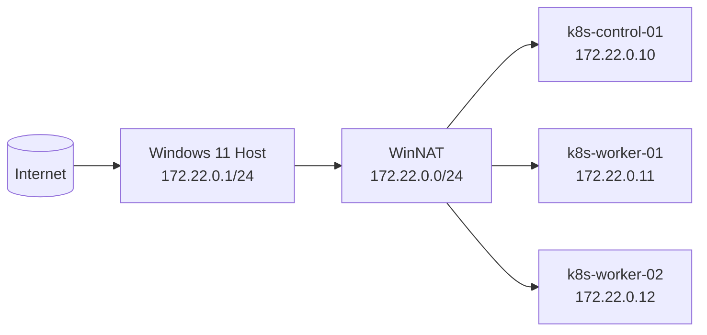
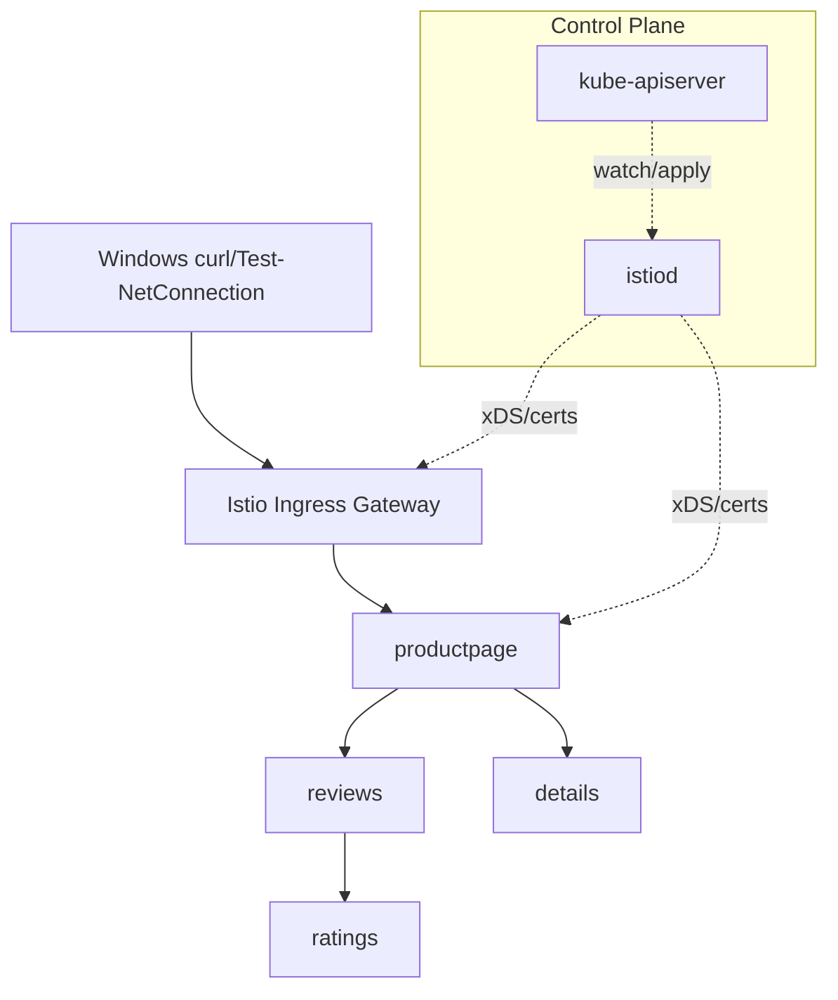

# istio-practical-lab

Production-oriented, hands-on Istio learning lab running on Kubernetes VMs hosted by Hyper-V on Windows 11 Pro.

## Project purpose

Build a reproducible path from infrastructure bootstrap to advanced Istio operations (traffic, security, observability, ambient, upgrades, and GitOps).

## Target audience

Experienced backend/platform architects with strong Kubernetes and networking fundamentals and limited practical Istio exposure.

## Architecture overview

- Host: Windows 11 Pro + Hyper-V + PowerShell 7
- Cluster: kubeadm + containerd + Calico + MetalLB
- Mesh: Istio via `istioctl` first, Helm lifecycle later

## Hyper-V network diagram

## Kubernetes + Istio architecture

## VM sizing

| VM             | vCPU | RAM | Disk |
|----------------|-----:|----:|-----:|
| k8s-control-01 | 4    | 6GB | 60GB |
| k8s-worker-01  | 4    | 6GB | 80GB |
| k8s-worker-02  | 4    | 6GB | 80GB |

## IP address plan

See `/docs/ip-address-plan.md`.

## Prerequisites

- Windows 11 Pro, Hyper-V enabled
- PowerShell 7+, Windows Terminal, Git
- 16GB RAM minimum (32GB recommended), 100GB free disk
- Ubuntu Server ISO downloaded locally

## Version matrix

Pinned versions are centralized in `/versions.env` and compatibility rationale is in `/docs/version-compatibility.md`.

## Quick-start path

1. Validate Windows host: `pwsh -File hyperv/powershell/Test-LabPrerequisites.ps1 -ConfigPath hyperv/config/lab-config.psd1`
2. Enable Hyper-V: `pwsh -File hyperv/powershell/Enable-HyperV.ps1`
3. Create virtual switch/NAT: `pwsh -File hyperv/powershell/New-LabNetwork.ps1 -ConfigPath hyperv/config/lab-config.psd1`
4. Create Ubuntu VMs: `pwsh -File hyperv/powershell/New-LabVMs.ps1 -ConfigPath hyperv/config/lab-config.psd1`
5. Configure Ubuntu networking manually: see `exercises/01-hyperv-infrastructure/README.md`
6. Prepare nodes: `sudo bash scripts/linux/prepare-node.sh`
7. Initialize control plane: `bash scripts/install/initialize-control-plane.sh`
8. Install Calico: `bash scripts/install/install-calico.sh`
9. Install MetalLB: `bash scripts/install/install-metallb.sh`
10. Install Istio: `bash scripts/install/install-istio.sh`
11. Deploy Bookinfo: `bash scripts/install/deploy-bookinfo.sh`
12. Run smoke tests: `bash scripts/smoke/run-smoke-tests.sh`

## Complete learning roadmap

See `/docs/learning-roadmap.md` and `/exercises/01-hyperv-infrastructure` ... `/exercises/20-gitops`.

## Repository navigation

- `hyperv/`: Hyper-V automation + config
- `scripts/`: Linux install, diagnostics, smoke, reset utilities
- `kubernetes/`: kubeadm, Calico, MetalLB, and supporting manifests
- `istio/`: install profiles, gateway, traffic/security/ambient/upgrades
- `applications/`: Bookinfo and Spring microservice scaffolding
- `tests/`: smoke/integration/policy/performance placeholders

## Reset and cleanup warnings

Cluster and lab destruction operations are explicit and destructive. Always create checkpoints/backups first.

## Security disclaimer

This repository is for learning. Do not store secrets, private keys, kubeconfigs, or production credentials.

## Local-environment limitations

Hyper-V NAT and laptop resources influence latency and throughput. Results must not be treated as production capacity data.

## Contribution guidance

See `CONTRIBUTING.md`.

## License

MIT, see `LICENSE`.
