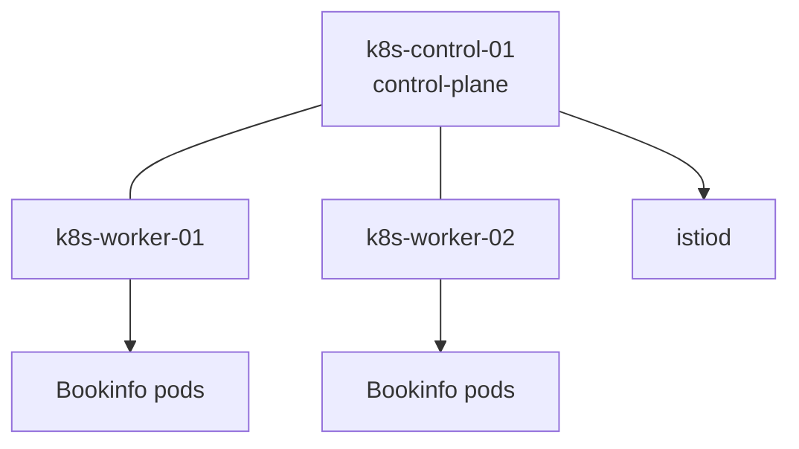
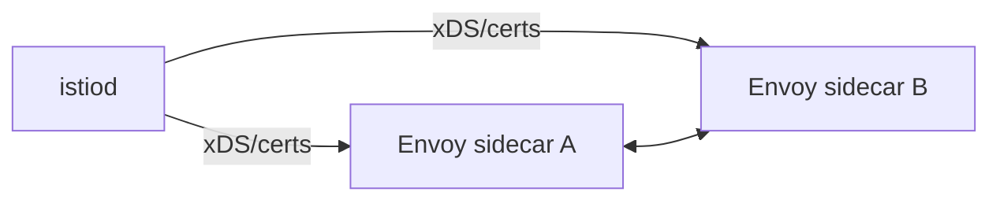

# Architecture

## Layers

1. **Infrastructure**: Hyper-V internal switch + WinNAT + Ubuntu VMs
2. **Kubernetes**: kubeadm control plane, containerd runtime, Calico CNI, MetalLB L2
3. **Service mesh**: Istio control plane + sidecar/ambient data plane modes
4. **Applications**: Bookinfo and planned Spring microservices
5. **Validation**: smoke checks, diagnostics, and CI static analysis

## Kubernetes topology

## Istio control/data planes

## External-switch alternative

External vSwitch can be used instead of internal+NAT for direct LAN reachability, but it introduces DHCP dependency, possible corporate network policy conflicts, and reduced isolation for experimentation.
